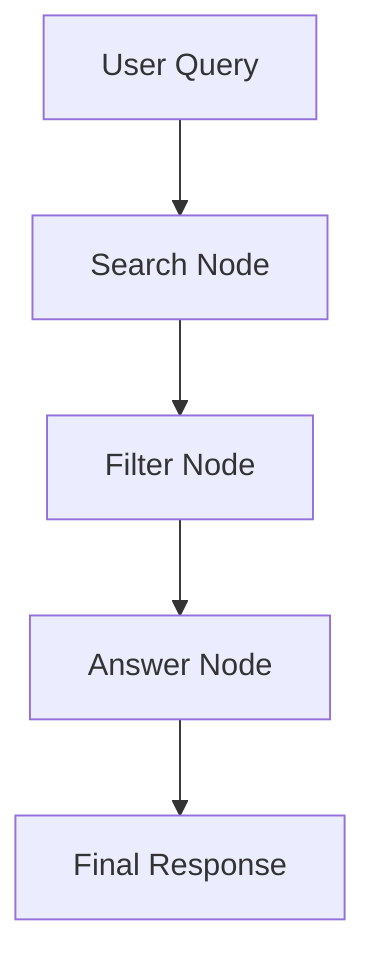

# AI Web Search Agent

This project implements an AI-powered web search agent that retrieves real-time information from the internet and generates grounded answers with source attribution. The system is built using LangGraph for orchestration, Groq for LLM inference, and DuckDuckGo (DDGS) for search.

The implementation is provided as a **Jupyter Notebook** for easier experimentation and step-by-step execution.

---

## Setup Instructions

### 1. Clone the repository

```bash
git clone https://github.com/Gagansherigar/Websearchagent
cd Websearchagent
```

### 2. Create a virtual environment

```bash
python -m venv .venv
```

Activate the environment:

* Windows:

```bash
.venv\Scripts\activate
```

* Linux / Mac:

```bash
source .venv/bin/activate
```

### 3. Install dependencies

```bash
pip install -r requirements.txt
```

### 4. Configure environment variables

Create a `.env` file in the root directory:

```env
GROQ_API_KEY=your_api_key_here
```

---

## How to Run the Project

1. Start Jupyter Notebook:

```bash
jupyter notebook
```

2. Open the notebook file:

```text
web_search_agent.ipynb
```

3. Run all cells sequentially:

* Install and import dependencies
* Define agent state
* Define LangGraph nodes (search, filter, answer)
* Build and compile the graph
* Execute the query

4. Modify the query in the final cell:

```python
result = graph.invoke({
    "query": "latest macbook specs 2026"
})
```

---

## Dependencies Used

* langgraph — workflow orchestration
* langchain — core abstractions
* langchain-community — DuckDuckGo tool
* langchain-groq — Groq integration
* groq — LLM backend
* ddgs — DuckDuckGo search backend
* duckduckgo-search — compatibility layer
* python-dotenv — environment variable loading
* ipython — visualization support

All dependencies are listed in `requirements.txt`.

---

## Architecture Overview

The system follows a deterministic pipeline implemented using LangGraph:



### Components

* Search Node
  Retrieves results from DuckDuckGo.

* Filter Node
  Cleans and limits the results.

* Answer Node
  Generates the final answer using the LLM based on retrieved context.

---

## Design Decisions and Trade-offs

### 1. Notebook-Based Implementation

The project is implemented in a single notebook to allow step-by-step execution and easier debugging.

Trade-off:

* Easier to understand and demonstrate
* Less modular than a multi-file production system

---

### 2. Deterministic Agent Flow

LangGraph is used to define explicit node transitions instead of autonomous agents.

Trade-off:

* More predictable and debuggable
* Less flexible than dynamic agent frameworks

---

### 3. Context-Restricted Answering

The LLM is constrained to use only retrieved content.

Trade-off:

* Reduces hallucinations
* May limit completeness if search results are weak

---

### 4. DuckDuckGo Integration

DuckDuckGo is used via DDGS for free and simple setup.

Trade-off:

* No API key required
* Results may be less accurate than paid providers

---

### 5. Output Control and Error Handling

The system uses prompt constraints, JSON parsing, and fallback cleaning.

Trade-off:

* Improves reliability
* Adds complexity to handling model outputs

---

## Project Structure

```bash
.
├── web_search_agent.ipynb   
├── requirements.txt
├── .env
└── README.md
```

---

## Running Locally

1. Install Python 3.10+
2. Install dependencies using `requirements.txt`
3. Add `GROQ_API_KEY` to `.env`
4. Launch Jupyter Notebook
5. Run all cells in order

---

## Notes

* The notebook includes visualization of the LangGraph workflow
* The system includes fallback handling for invalid LLM outputs

---
